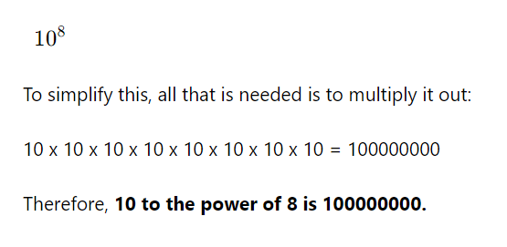

link Ref: https://byjus.com/maths/math-symbols/

10finding 10 to the power of 8

5 * 10 4 (4 varchy side la)   10 to the power of 4 (10*10*10*10)
 * (into)

 

 ^ raised to the power

 Concept You should know about maths

Addition (+) or Plus: used to add two numbers together; for example, 5 + 3 = 8.
Subtraction (−) or Minus: used to subtract one number from another; for instance, 9 − 6 = 3.
Multiplication (×) or Times: used to multiply numbers; such as 4 × 2 = 8.
Division (÷) or Divided by: used to divide one number by another; e.g., 12 ÷ 4 = 3. 

Squared (²): used to indicate a number raised to the power of 2; 3² = 9. (3 to the power of 2)
Cubed (³): used to indicate a number raised to the power of 3; 2³ = 8.  (2 to the power of 3)
Square Root (√): represents the non-negative value that, when multiplied by itself, gives the original number; √9 = 3.
Infinity (∞): a concept used to describe something without any bounds; often used in limits.
Approximately equal to (≈): used to show that two numbers are almost, but not exactly, equal; π ≈ 3.14.

Prime (ℙ): used to describe numbers that have only two divisors: 1 and itself; 2, 3, 5 are examples of prime numbers.

x, y, z: often used to represent unknown numbers or variables; in the equation y = 2x + 3, x and y are variables.
Equals (=): signifies that two expressions are the same; 5 = 5.
Not equal (≠): shows that two expressions are not the same; 5 ≠ 6.
Greater than (>): indicates that one number is larger than another; 7 > 3.
Less than (<): means one number is smaller than another; 2 < 5.
Greater than or equal to (≥): shows that a number is larger than or equal to another; x ≥ 4.
Less than or equal to (≤): denotes that a number is smaller than or equal to another; x ≤ 3.
Ratio (:): a comparison of two quantities; the ratio of 4 to 8 is 1:2.
Percent (%): one part in a hundred; 50% means half.

