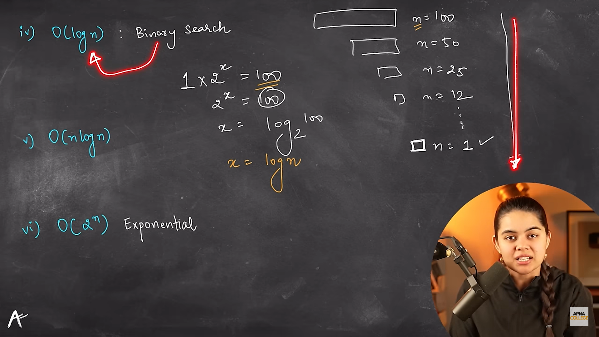
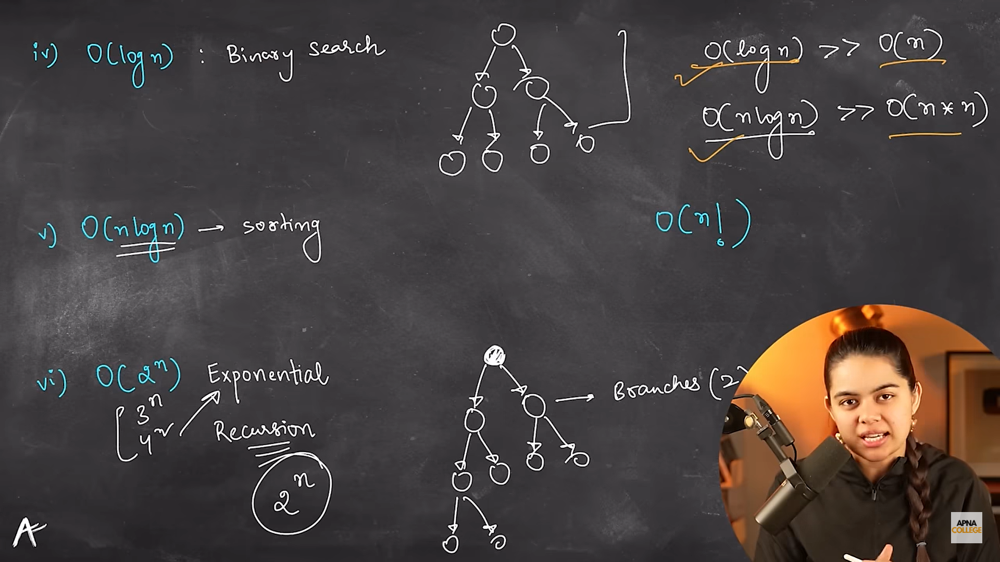
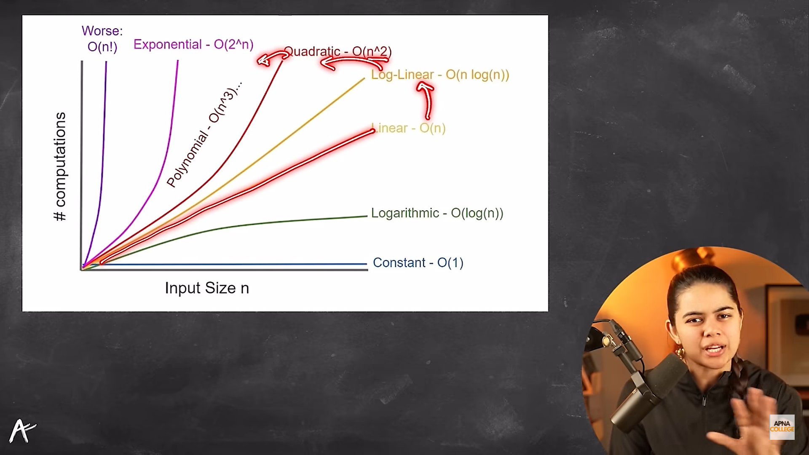

if input increase then us code ke number of operations kis perportion mai increase hua this is know as TC(time complexicity)

O(n) -: big O of n (y = x) (jaise 'n : input' ka size will raise number of operation will raise)
O(n3) -: big O of n qube(3)

Notation : besically a symbol ...Big O is nothing but notation
Big O -: defined worst case n good case (input and operation relation)
to build strong senario
(will make you think how your code perfom flexible in worst senario)

Comman Complexities
1. O(1) : Constant : Big O of 1

for eg 
```javascript
//even if you take array the function will always retun you 'Hello' constant value
//number of operation perfom by this function is only '1'(constant) not the 'n' number of array
function constantFun(array){
    return 'Hello'
}
constantFun([8, 9, 10]);

let arr = [1, 2,3];

function getValu(val){
    return  arr[val]
}
getValu(0) //1 time complexcity will be  O(1) as we know the place of array access value
```

2. O(n) : Linear : Big O of n ...at eg: loop

```javascript
let n = 5
for(let i = 0; i < n ;i++){
    console.log(n[i])
}
//how many times this opertation will perform is 'n' times
//so time complexicity is O(n)...jise humara 'n' : input size will increase ...number of operation will increase ...eg loop
```

3. O(n²) ... O(N^2) → Quadratic Time : Big O of n squre...n squre time complexicity ... nested loop ..double loop

n² : n squre
n3 : n qube (3 varchya side la)
n^4: n to the power of 4 (4 varchya side la)

undestand this
 n X n = n² (n multiple by n)
EG: for nested loop
for matrix function

4. O(log n) ...log n | O of log n 
Bianery search example

log (we create half result every time)
8 -> 4 -> 2 -> 1 (3)
16 => 8 => 4 => 2 => 1 (4)
2 => (1)

Log (ap ek array ko itni bar aadha karo ki woh khatam 1 ho jaaye)
   8 |  16 |  2
so 3 |  4  |  1  are ( log )

log n  means 'n' ko kitni bar aadha kar ki woh khatam ho jaaye

suppose if i say log(100)...it means
How many times can you half Log until it gets close to 1?
 100 => 50 => 25 => 12 => 6 => 3 => 1.5

 log m^n (m to the power of n) = n log m

 if you are making half count of given array so its log n

1 X 2^x (x varchya side la aahe) : we called this (2 to the power of x)

in images 'x' is number of operations

4. O(n log n) ....big O n log n
most propbably use for Sorting

5. O(2n) (n varchy side la)...exponential 
Recursion

Base n === branches
Tabulation..memoization...expotentional complexcity


Computation means number of operations

f(n) function : n is the input
suppose if there will be 10or15 array then the size of function input is 10 or 15


