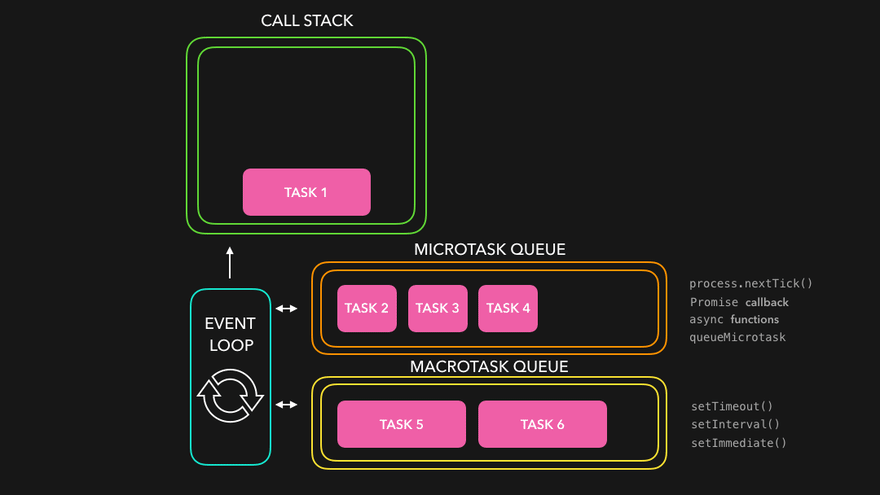

# Synchronous JavaScript (asked in interview)

Synchronous means to be in a sequence, i.e. every statement of the code gets executed one by one. So, basically a statement has to wait for the earlier statement to get executed.

The code will execute the tasks in the order you see them and wait for each task to be completed before moving on to the next one.

JavaScript claims that it is single-threaded, synchronous and blocking in nature.

Synchronous callbacks are blocking in nature.as each task has to wait for the previous tasks to get done.

synchronous programming can be problematic in certain situations, particularly when dealing with tasks that take a significant amount of time to complete.

Eg:
synchronous program performs a task that requires waiting for a response from a remote server.
The program will be stuck waiting for the response and cannot do anything else until the response is returned. This is known as blocking, and it can lead to an application appearing unresponsive or "frozen" to the user.

# Is Javascript single-threaded?

Yes, JavaScript is a single-threaded language. This means that it has only one call stack and one memory heap. Only one set of instructions is executed at a time.

Also, Javascript is Synchronous and blocking in nature. meaning that code is executed line by line and one task must be completed before the next one begins

However, JavaScript also has asynchronous capabilities, which allow certain operations to be executed independently of the main execution thread. This is commonly achieved through mechanisms like callbacks, promises, async/await, and event listeners. These asynchronous features enable JavaScript to handle tasks such as fetching data, handling user input, and performing I/O operations without blocking the main thread, making it suitable for building responsive and interactive web applications.

# Asynchronous JavaScript (asked in interview)

Asynchronous programming is a way for a computer program to handle multiple tasks simultaneously rather than executing them one after the other.

Asynchronous is a non-blocking architecture, so the execution of one task isn't dependent on another. Tasks can run simultaneously.

it does not block the rest of the code from executing and after all the code its execution, it gets pushed to the call stack and then finally gets executed. This is what happens in asynchronous JavaScript.

eg. setTimeout()...addEventListenet("click" , function);
Data Fetching | retrieves data from a remote server,
Calling Backend API's
Loading Files
Timers and Intervals

asynchronous doesn't cause any "blocking" or "freezing" behaviour. This approach can greatly improve the performance and responsiveness of a program.

In JavaScript, asynchronous programming can be achieved through a variety of techniques.

1. Callback Function
2. Promise
3. Async and Await

Callbacks, Promises, and Async/Await they all enable the execution of non-blocking code. This means JavaScript engines can execute other tasks/operations while waiting for an asynchronous operation to complete, they are similar in nature to Non-blocking and efficient code execution flow.

## example

```javascript
function fetchData(callback) {
  setTimeout(() => {
    let data = { name: "kavita", company: "wipro" };
    callback(data);
  }, 2000);
}

fetchData(function (data) {
  console.log(data);
});

console.log("data is fetching from server");
```

To understand the asynchronous behavior of JavaScript while using the setTimeout function we need to get familiar with the event loop.

Our web browser consists of a JavaScript engine, web APIs, local storage, timers, etc. JavaScript engine contains a single call stack in which all the code is executed immediately as and when it is pushed without waiting.

Now, we need to understand that the setTimeout function is not a part of JavaScript but it is a part of the web browser as it is essentially a web API and the browser allows the JavaScript engine to access the setTimeout function with the help of the global window object.

# How does JavaScript's event loop work?

In JavaScript, an event loop is a mechanism used for managing asynchronous operations and executing callbacks non-blocking. It is a single-threaded loop that continuously monitors the call stack and the callback queue.

The call stack is a data structure that tracks the execution of functions in JavaScript. Whenever a function is invoked, it is pushed onto the call stack. When the function completes its execution, it is popped off the stack.

Web APIs is the place where the async operations (setTimeout, setIntervals, fetch requests, promises, async await) with their callbacks are waiting to complete

On the other hand, the callback queue holds a list of functions ready to be realized once the call stack is empty. Whenever an asynchronous operation, such as an event listener, settimeout, setIntervales or a network request, completes its execution, its associated callback function is pushed into the callback queue.

When the call stack is empty, the event loop takes the first function from the callback queue, pushing it to the call stack, which effectively runs it. This process continues indefinitely, with the event loop continuously monitoring both the call stack and the callback queue to ensure that JavaScript code is executed in a non-blocking and efficient way.

In the JavaScript runtime, the event loop handles async operations. It can only call the callback functions of async instructions when the call stack is empty.

The JavaScript Runtime actually has these two queues—the Callback (or Macrotask) Queue and the Job (or (Microtask)) Queue. Shortly before the event loop starts calling the functions in the Callback Queue, it calls all the instructions on the Job Queue. The callback of a promise stays in the Job Queue so the event loop calls it first. This is why promises return values faster than any other async implementation.

The Event loop permanently monitors whether the call stack is empty. If the call stack is empty, the event loop looks into the job(Microtask) queue or task(Macrotask) queue and dequeues any callback ready to be executed into the call stack.

Illustration depicting the Microtask Queue and the Callback (Macrotask) Queue


# Callback Hell

Is happend when you have more than a few things that depend on each other...it can difficult to read..
Callbacks provide a useful way to handle asynchronous operations. However, when many callbacks are nested, the code can be complex and hard to read and understand.

Callback Hell, also known as “Pyramid of Doom” is a term used in JavaScript programming to describe a situation where multiple nested callbacks are used within asynchronous functions.

“It occurs when asynchronous operations depend on the results of previous asynchronous operations, resulting in deeply nested and often hard-to-read code.” (IMP)

## example

eg:

```javascript example of async callback
api.makePayment(orderId, function (amount) {
  return api.orderConfirmation(amount, delivery, function () {
    return api.redirectToHome();
  });
});

getData(function (a) {
  getMoreData(a, function (b) {
    getEvenMoreData(b, function (c) {
      getEvenEvenMoreData(c, function (d) {
        getFinalData(d, function (finalData) {
          console.log(finalData);
        });
      });
    });
  });
});

/* The getData function takes a callback as an argument and is executed after data is retrieved.
The callback function then takes the data and calls the getMoreData function, which also takes a callback as an argument, and so on.
code difficult to maintain and even harder to see the overall structure of the code
*/
```

To avoid callback hell, you can use a more modern way of handling async operations known as promises. Promises provide a more elegant way of handling the asynchronous flow of a program compared to callback functions. This is the focus of the next section.

# What is Promise

The Promise object represents the eventual completion (or failure) of an asynchronous operation and its resulting value.

You can say its more organised way to handle async operation as compare to callback

## A Promise is in one of these states

pending: initial state, neither fulfilled nor rejected. value is not availabel.
fulfilled: meaning that the operation was completed successfully.
rejected: meaning that the operation failed.
settled : It's important to note that a promise is said to be settled when it is resolved or rejected.

Promises are incredibly useful in JavaScript because they let developers write cleaner and more efficient code for handling asynchronous operations. You can chain multiple asynchronous operations, handle errors gracefully, and simplify your code.

example of promise

```javascript
function getArticle(id) {
  return new Promise((resolve, reject) => {
    setTimeout(() => {
      console.log("Fetching data....");
      resolve({ id: id, name: "derik" });
    }, 5000);
  });
}

getArticle("1").then((res) => console.log(res));
```

Next, callback functions are then attached to the promise to handle the outcome of the action. These callbacks will be invoked when the promise is fulfilled (action completed successfully) or rejected (action failed).

# How to Create a Promise

To create a promise, you'll create a new instance of the Promise object by calling the Promise constructor.

The constructor takes a single argument: a function called executor. The "executor" function is called immediately when the promise is created, and it takes two arguments: a resolve function and a reject function.

Promise constructor has two parameters (resolve, reject) which are functions. If the async task has been completed without errors then call the resolve function with message or fetched data to resolve the promise.

If an error occurred then call the reject function and pass the error to it.

we can access the result of promise using .then() handler.

we can catch the error in the .catch() handler.

```javascript
// Initialize a promise
const myPromise = new Promise(function (resolve, reject) {});
/* new Promise: promise constructor... create new instance of the Promise object
function: executor function
resolve: function to call if an operation completes successfully
reject : function to call if an operation fails */

const myPromise = new Promise((resolve, reject) => {
  setTimeout(() => {
    resolve("hey...i m here");
  }, 2000);
});
```

## how to consume promise and Chain Promises

Promise chaining: The process of executing a sequence of asynchronous tasks one after another using promises is known as Promise chaining.

The methods Promise.prototype.then(), Promise.prototype.catch(), and Promise.prototype.finally();

One of the key features of Promises is the ability to chain them together, enabling sequential execution of asynchronous operations and avoiding callback hell.

To chain Promises, you use the .then() method, which takes a callback function as its argument. This callback function receives the resolved value from the previous Promise and can return another Promise or a value.

### why use then() method

then() is called on the promise object and provides a callback function that will be executed when the Promise is resolved. returns a new promise , resolving to the return value of the called handler

It's important to keep in mind that .then() methods are executed asynchronously and in order, each one waiting for the previous one to be resolved, and that the returned value of each .then will be passed as an argument to the next one.

.then() constructor, we can show the resolved output as a response.

You can use the .then() method to handle the successful resolution of a Promise and the .catch() method to handle any errors that occur.

You can chain Promises together using the .then() method, which returns a new Promise that resolves to the value returned by the callback function.

### Error Handling

When a promise is rejected, it will trigger the .catch() method, which handles errors. The .catch() method takes a single argument, which is the error thrown.

//This is another example showing a more practical example.

```javascript
myPromise
  .then((response) => console.log(response))
  .cath((error) => console.log(error))
  .finally(() => {
    //code here will be executed regardless of the status
    //of a promise (fulfilled or rejected)
  });

fetch("https://example.com/data")
  .then((response) => response.json())
  .then((data) => processData(data))
  .then((processedData) => {
    // do something with the processed data
  })
  .catch((error) => console.log(error));

getArticles(10)
  .then((user) => getUserName(user.name))
  .then((place) => getAddress(place.city))
  .then((data) => console.log("Data", data))
  .catch((err) => console.log("Error: ", err.message));
```

#### Understand THis

Promises utilize an event-driven mechanism and leverage the JavaScript event loop to execute asynchronous operations.
When a Promise is created, the executor function is called immediately, and the asynchronous operation starts.
The Promise registers callbacks internally and allows other synchronous operations to continue while it awaits the completion of the asynchronous task.

## simple eg

```javascript
const myFirstPromise = new Promise((resolve, reject) => {
  setTimeout(() => {
    resolve("Success");
  }, 2000);
});

myFirstPromise.then((response) => {
  console.log(response); //Success
});
```

# Async Functions with async/await

async and await are syntactic sugar built on top of Promises. async functions implicitly return a Promise, and await is used to pause the execution of the function until the Promise is resolved or rejected.

In JavaScript, the async keyword is used to define an asynchronous function, which returns a Promise.

"await" is a keyword that is used inside an async function to pause the execution of the function until a promise is resolved or we can say an asynchronous function is paused until the request completes.

It is similar to the .then() method which makes sure a promise is ‘fulfilled’ or ‘rejected’ before it continues.

we can consume promise by then() or await as well

Async not depends on await
Await is depends on Async

```javascript
async function example() {
  return "Feels good to be an async function";
}

example();

// Output on the console

// *Promise {<fulfilled>: "Feels good to be an async function"}*

async function getData() {
  try {
    const response = await fetch(
      "https://jsonplaceholder.typicode.com/posts/1"
    );

    if (!response.ok) {
      const message = `An error has occured: ${response.status}`;
      throw new Error(message);
    }

    const data = await response.json();
    console.log(data);
  } catch (error) {
    console.error(error);
  }
}
getData();

async function fetchData() {
  try {
    const data = await fetch("https://example.com/data");
    const jsonData = await data.json();
    return jsonData;
  } catch (error) {
    throw error;
  }
}

// Using the async function
fetchData()
  .then((jsonData) => {
    // Handle the retrieved data
  })
  .catch((error) => {
    // Handle errors
  });
```

# //Promise concurrency or Static methods

- Promise.all()
- Promise.race()
- Promise.any()
- Promise.allSettled()

# What is the purpose of the Promise.all() method?

The Promise.all() method takes an array of Promises and returns a new Promise that resolves when all of the input Promises have resolved.

- if any promise will failed...then will get only those rejected promise not the resolve once and goes to catch..not getting any result
- if all are fullfilled then get resolved and goes to then()

# What is the purpose of the Promise.race() method?

The Promise.race() method takes an array of Promises and returns a new Promise that resolves or rejects as soon as one of the input Promises resolves or rejects.

- all promise settled after then (wait until the last fullfilled or reject) we got the result...
- even if its reject we get the result in then...it not catch in catch method

//remember this

## 1. promise.all :

// - if any promise will failed...then will get only those rejected promise not the resolve once and goes to catch..not getting any result  
 // if all are fullfilled then get resolved and goes to then()  
 //it will resolve as per the time we provided

## 2. promise.allSettled

    //all promise settled after then (wait until the last fullfilled or reject) we got the result...
    //even if its reject we get the result in then...it not catch in catch method

## 3. promise.race

     //which ever promise will resolve or reject, it will retrun the first one, will not check for other promisees
     //if the first promise is reject and after that next promise is resolve still it will return the reject promise
     //not the resolve one
     // will resturn only one promise not the array


## 4 promise.any

     //it always return the resolve promise first ...if the first promise is reject it will ignore it
    //it will return only one first resolve promise...not the other promise which resolve after this
    // it will ignore the reject promise
    //if all promise were reject then in this case it will give summary inside catch
    //will get "AggregateError": all promise were rejected...how to show it
    //catch((error) => error.errors) ///will get the error in array formate

example

//Promise concurrency or Static methods

```javascript
let p1 = new Promise((resolve, reject) => {
  setTimeout(() => {
    reject("promise 1 resolve");
  }, 4000);
});

// let p1 = Promise.resolve('promise 1 resolve')

let p2 = new Promise((resolve, reject) => {
  setTimeout(() => {
    reject("promise 2 resolve");
  }, 4000);
});

let p3 = new Promise((resolve, reject) => {
  setTimeout(() => {
    reject("promise 3 reject");
  }, 6000);
});

Promise.any([p1, p2, p3])
  .then((res) => {
    console.log("res", res);
  })
  .catch((err) => {
    console.error("err", err.errors);
  });
```

# diff between localstorage, sessionstorage and cookies

The Web Storage API provides mechanisms by which browsers can securely store key/value pairs.

- The localStorage read-only property of the window interface
- allows you to access a Storage object for the Document's origin;
- the stored data is saved across browser sessions.

# with the help of localstorage and sessionstorage, we can store data locally within the user's browser.

## Difference between localStorage and sessionStorage

localStorage is similar to sessionStorage, except that while localStorage data has no expiration time, sessionStorage data gets cleared when the page session ends — that is, when the page is closed. (localStorage data for a document loaded in a "private browsing" or "incognito" session is cleared when the last "private" tab is closed.)

```javascript
localStorage.setItem("myCat", "Tom"); //add items in storage
const cat = localStorage.getItem("myCat"); //for reading the localStorage item
localStorage.removeItem("myCat"); //removing from localStorage
localStorage.clear();
```

Before HTML5, application data had to be stored in cookies, included in every server request. Web storage is more secure, and large amounts of data can be stored locally, without affecting website performance.
