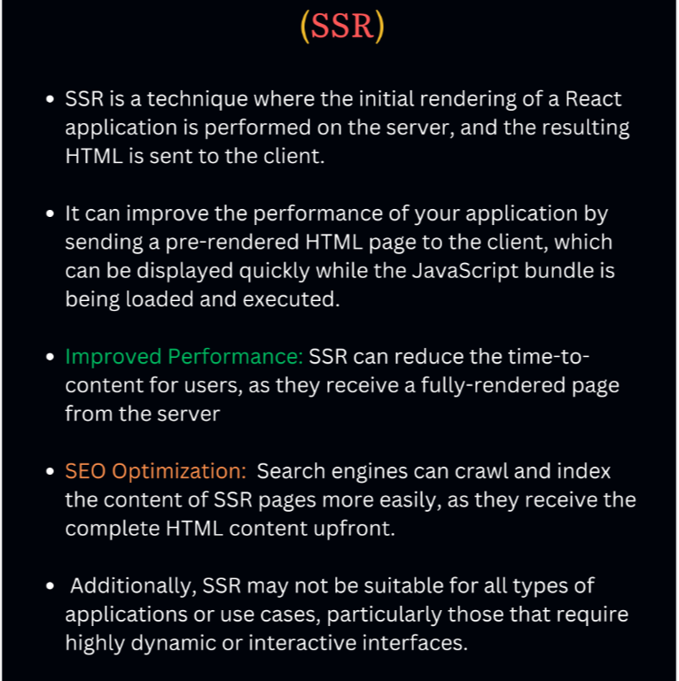

# Why do we need React and React DOM? (Interview 1)
React is used to create component whereas the ReactDom is used to convert that component into actual DOM, Node elements so browser will able to understand the code of React.
React DOM helps to build : WEB UI
React Native helps to craft : Mobile APP

# what is rendering?

Redering meaning calling component (trigger the component) once again but with the updated value

calling === rendering (calling component is equivalent to rederning component)

load page << Render << Feching (useEffect) << Render

Whenever state variable update, react triggers a reconciliation cycles(re-render the components)

# Types of Components (INTERVIEW 2)
# What is the difference between class component and function component? (Interview 3)

Function component is defiend by function where as class component is defiend by class keyword.

Function Component is normal Javascript function. Class Component use the class Syntax.

.Class-based Components - Old way of writing code.
Class component can manage their state, and they have life-cycle methods where as initially function component don’t have state management and lifecycle method that’s why they called stateful and stateless component respectively, but in 2019 in react version 16.8 react introduce hooks …where we can use useState(maintain state) and useEffect (for lifecycle pattern) 

# What is stateless and stateful component? (INTERVIEW 1)

initially function component don’t have state management and lifecycle method that’s ,
before react introduce hooks...there is a concept of stateless and statefull component
we called class component to Statefull component as they manage their own state, they have lifecycle methods (like componentDidMount, componentDidUpdate, etc.).

use case: A classic example is a form input
 With the introduction of Hooks in React 16.8, functional components have become more powerful, allowing them to use state, use effect, useref and other React features without being class-based.
 TO manage and maintain easily as compare to class component.
 use case: button or a display label. These components receive all the data they need via props and render accordingly.

 With the advent of Hooks, the line between stateful and stateless components has blurred.
This distinction not only helps in organizing the codebase but also in optimizing the performance and maintainability of React applications.


# What is Virtual DOM? Why React is fast (INTERVIEW)
It is a object representation of Actaul Dom 
DOM manipulation is very expenssive and react is very efficient to doing this.
the whole component re-render only update the changing part not the entire (remember reconciliation...old dom and new dom and show the update dom)...
## REACT is FAST because
1. react fiber
2. new reconciliation algo (which find the difference between the two virtual dom and only update the reuired part in that changes happens)
3. the whole component re-render only update the changing part not the entire (remember reconciliation...old dom and new dom and show the update dom)

# What is Virtual DOM? What is the difference between DOM and Virtual DOM? Why do we need Virtual DOM
# What Is Reconciliation Diff Algorithm, React Fiber? How the virtual Dom is faster? (INTERVIEW)

 It it momoery representation of actual DOM. Which helps to improve perforamance and changes of actual DOM by reduing number of expensive DOM Manipulation.

 DOM (document object model) that represents web page like tree structure Dom, which allow JS to dynamically added, update, manipulate node in the structure of web page.
Basically in the plain JS if we add or change some thing on the page, the whole layout will be re-render which will refresh the entire DOM, that’s why react brings the concept of virtual Dom, in that react behind the scene react create exact copy of real dom. And if you make changes in it, react  uses( React Fiber is a Reconciliation Diff Algorithm) will keep track between the  previous and current version of DOM, whatever update will reflect on Actual Dom on Browser. that why react is faster because its avoid refreezing entire page which improves performance.

# What is JSX? Why Dd we need JSX? (INTERVIEW)
JSX is HTML-like or XML-like syntax. JSX stands for JavaScript XML. It's a syntax extension for JavaScript
React create components. 
Component -> internally react create component instance state -> it generate element -> then it generate Plain Object…which contains type, key, ref, prop, key children, symbol…but this is not maintainable and expressive, its very difficult to parse that’s why JSX exist
This process generate TREE of elements, This knows as virtual Dom….this is core guide principle.
C, CIS, E, PO, it contains t, k,r, p, c, s…this is difficult to parse that why JSX exist.

# What is Pure Component? (INTERVIEW 3) 

PureComponent is similar to Component but it skips(optimise) re-renders for same props and state. 
PureComponent class is used to make a component pure in React.
Pure component optimise re-renders and thus improves performance. Skipping unnecessary re-renders for class components 

Functional components do not enjoy the benefits of pure compoents which extends PureComponent class.

To optimize re-rendering in React we can use the shouldComponentUpdate() lifecycle method to control whether a component should re-render or not. But react also provides us a Pure Component 
( React.PureComponent).

A type of component, that only re-renders when its props or state change.  They are also referred to as “stateless components” or “dumb components”.

```javascript
import React from 'react';

const PureComponent = ({ name }) => {
  return <div>Hello, {name}! This is a pure component.</div>;
};

export default PureComponent;

```
In React, you can utilize Memo components to enhance your application’s performance. Memo components, a specific type of pure component, operate similarly to functional components but incorporate an additional optimization layer.

A React component is considered pure if it renders the same output for the same state and props. For this type of class component, React provides the PureComponent base class. Class components that extend the React.PureComponent class are treated as pure components. To create a pure class component, one can extend the PureComponent class instead of the standard Component class. 

```python
class Title extends React.PureComponent {
  render() {
    return <h1>{this.props.title}</h1>;
  }
}
```

# lifecycles of class component? (Interview 2)

1. Component Mount (Initial Render) 
   a. A component “mounts” when it renders for the first time.
   b. fresh props and state created 

2. Component Re-render (Update)
    a. State and props changes
    b. parents re-render
    c. context changes

3. Component Un-mount (Component Destroy)
    a. A component’s unmounting period occurs when the component is removed from the DOM. 
    b. state and props destroy
    c. user navigates to a different website or closes their web browser or app.
    d. DOM is rerendered without the component,


# Controlled vs Uncontrolled Components in ReactJS (INTERVIEW 3)

In React, Controlled components refer to the components where the state and behaviors are controlled by Parent components while Uncontrolled components are the ones having control of their own state and manage the behaviors on themselves.

## Uncontrolled
Uncontrolled Components are the components that are not controlled by the React state and are handled by the DOM (Document Object Model). So in order to access any value that has been entered we take the help of refs.
For instance, if we want to add a file as an input, this cannot be controlled as this depends on the browser so this is an example of an uncontrolled input.

 ```javascript
 const inputRef = useRef(null); //You can store and persist value in between renders
 
    function handleSubmit() {
        alert(`Name: ${inputRef.current.value}`);
    }
 <form onSubmit={handleSubmit}>
                <label>Name :</label>
                <input
                    type="text"
                    name="name"
                    ref={inputRef}
                />
                <button type="submit">Submit</button>
            </form>
 ```

## Controlled Components
In React, Controlled Components are those in which form’s data is handled by the component’s state. It takes its current value through props and makes changes through callbacks like onClick, onChange, etc. A parent component manages its own state and passes the new values as props to the controlled component.

 ```javascript
 const [name, setName] = useState("");
 
    function handleSubmit() {
        alert(`Name: ${name}`)
        }

         <form onSubmit={handleSubmit}>
                <label>Name :</label>
                <input
                     name="name"
                    value={name}
                    onChange={(e) =>
                        setName(e.target.value)
                    }
                />
                <button type="submit">Submit</button>
            </form>
 ```    

# What is useRef();

useRef hook will help you to keep reference a value that’s not needed for rendering.
You can store and persist value in between renders

useRef returns a ref object with a single "current" property initially set to the initial value you provided. You can change its current property to store information and read it later. 

IMP: Changing a ref does not trigger a re-render. 

USecase
//Referencing a value with a ref
//Manipulating the DOM with a ref

//Referencing a value with a ref
```javascript
export default function Counter(){
  let ref = useRef(0);

  function showCounter(){
    ref.current = ref.current + 1;
    alert(`You clicked ${ref.current} times`)
  }

  return(
    <button onClick={showCounter}>Click me</button>
  )
}

```
Manipulating the DOM with a ref...eg input element you can access the ref with ref attribute eg..
<input type="text" name="name" ref={inputRef} />


# What are the HOC in react? (INTERVIEW 4 TRY code)

Higher Order Component, is a function that take component as an argument return new component with updated values (or we can say  additional properties or behavior). 
1. It’s technique that allows you to use to re-use logic, across multiple component. 
2. keeping our code DRY (Don't Repeat Yourself)
3. our components clean and focused.


# What is useState and useEffect hooks in functional component?

useState : we use this hook to store our data in local state variable like private in component.
Whenever state change component re-render again.

useEffect: it means that we want to register side effect, what i ment by this , load the data inside useeffect wala after the component, has been painted onto th screen.
eg: fetching, subscribe, timer, subscription

it has 2 argumets 1 is callback function, 2nd dependanct arreay
1. without array: useEffect will run every render
2. with []: it will runs only when compoent mount (initial render), as we didn't mention any dependancies in it.
3. with [dependancyArra1, dependancyArray2]...runs only when compoent mount (initial render) and whenver the state variable change the depency array change it will re-render

# What is props
   Props is an object... 
  Passing props to function is just like passing arguments to function. Passing props to a component means passing data dynamically from one component to another component.

# Why we use Key 
  not putting keys is not accessible : react will give you warning
  to identify unique of newly added item in map loop.
  React official doc's say never use "index" as key  


# How to optimize React App
1. Lazy Loading / Code Splitting

  Large bundle size can increase the initial loading time of your application.
  With React.lazy, you can lazily load components to improve initial load times, which means component load when they are needed.
  if you have heavy files that will slow down your application.
  so to metigate the loading performance we used Lazy Load to optimise the application
  so when compoent load 

  code splitng : is a technique that allows to split your code into smaller chunk, which are loaded on demand.

  It helps to reduce the inital bundle size and improve the loading performance of your application.

  ```javascript
  import {Suspense} form 'react'
  //React.lay dynamically import components
  let MyComponent = React.lazy(() => import("mention your path"));
  //fallback: is another compoent
  //<Suspense> lets you display a fallback UI until its children(Component) is being loaded.

  <Suspense fallback={<p>This content is loading</p>}>
    <MyComponent />
  </Suspense>
  ```

2. useMemo...memoize costly computation
useMemo hook lets you cache the result of a calculation between re-rendering.
due to this, it optimise the performance by avoiding unnecessary re-computation of expensive operations 
When props change, the component re-render and if there is any heavy function that will depend on props change ...it will compute again and again
 to avoid this we can use  "useMemo" : 
 useMemo will take (callback function and dependancy array[])

 when we use any complex calculation we use useMemo to memorise thing

 eg : 
 ```javascript
 import {useMemo} form 'react'
 
const totalEntries = useMemo(() => heavyOperationFunction(largeJsonFile), [dependencies])
 ```

3. useCallback is a React Hook that lets you cache a function definition between re-renders.

When you work with event listeners use useCallback
when you add event listner you have to clean them up.

eg.

```javascript
const handleOnWindload = useCallback(() => {
  console.log("Loaded")
}, []);

//whenyou use use Callback you have to clean up function
useEffect(() => {
  //when you add
  window.addEventListener("load", handleOnWindload); //addEventListener

  return() => { //unMount
    windown.removeEventListener("load", handleOnWindload);  //removeEventListener
  }
}, [handleOnWindload])


4. React.memo(): Minimizing re-renders with React.memo();
React.memo is higer order component that memoizes the result of components rendering;
It skips the unnecesary re-renders if component props remain the same (IMP)

Component only re-render if its props change.this will help to optimise performance our 

5.Debouncing:
Debouncing is a technique used to delay the execution of a function until after a certain amount of time has passed since last invocation

It is commanly used for hadaling expensive operations triggered by user events, such as input evetns and search requests.

eg: lets exaple of serach input field. when a user types in the serach box, an event is trigger for every keystroke.
Without debouncing, this call lead to expensive API calls or unnecessary processing
By debouncing the event handler, we can ensure that the search function is called only after the use has finished or paused for speicifed duration

eg: https://www.freecodecamp.org/news/debouncing-explained/
Api Try: https://api.postalpincode.in/pincode/421503

6. CDN : Content Delivery Nextwork

Its service that accelerates internet content delivery: CDN makes your website faster
Increase Speed
Reduction Load
Ref link: https://www.youtube.com/watch?v=Bsq5cKkS33I

7. SSR : SErver Side Rendering


```

