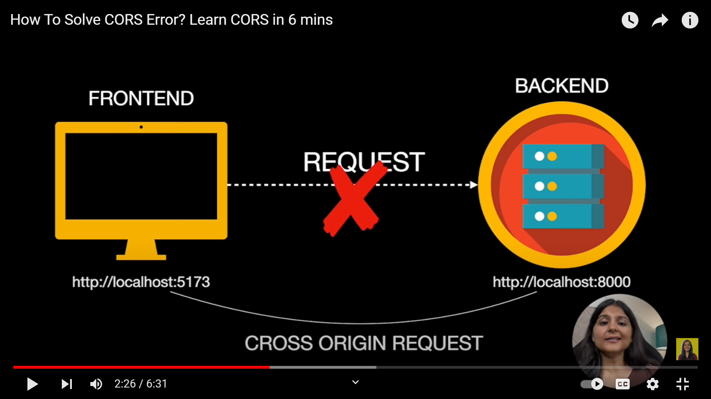

Ref Link: https://www.telerik.com/blogs/all-you-need-to-know-cors-errors

 CORS: Cross Origin Resource Sharing
 CORS Errors are Browser Errors

 its browser sequrity feature
 restricts different origin HTTP request

 Its mechanism which allow web pages in one domain to make request and interact with resources hosted on some other domain, but other browser not allowed to do so by default the anwser is no
 
 You need only to remember that CORS errors are browser errors and not an error with the endpoint you’re requesting.

when both origins are different this is CROS
and according to same origin policy of the browsers resource sharing are only allowed if both have the same origin hence such request are not allowed
this can be possible with help of CROS...this will allows servers to specify who can access their resources and under what conditions

It allows web developers to specify which domains are allowed to access their resources, as well as control the types of requests that can be made and the types of data that can be returned

when we send a request, a header goes with it. header contains multiple information..like host..
method: GET|POST|UPDATE|DELETE...

then you get the response from the server site

"Domain A" wants to access some resouces from "Domain B";

header will also send ..it contains some information which request to server and then server send you response

when you request : the browser triggers a request to the server. browser does not send you the actual request it send pre-flight request that browser triggers and send it to server. In preflight request two conditions are very necessary, ORIGIN and METHOD that we are asking. So the other webservice or domain that you want to access its important both contions are fullfilled. response mai aana jaruri hai. Allow this domain and method. If preflight request execute successfully then only your actual request is sent.then you will get the data whta yor requesting for.and you are able to show on your front-end

And there are multiple things in header...but two imp things are very important
1. Access-Control-Allow-Origin: 'your domain A site' (beacse Domain A wants to access the resource of Domain B) || * (allow for every domain)
2. Access-Control-Allow-Method: GET | POST

# Response aayega from server
Access-Control-Allow-Origin: 'Domain A.com'
Access-Control-Allow-Method: POST
Access-Control-Allow-Headers: Content-Type, Authorization

# this request send by Domain A to Domain B (Headers mai these all properties we send it through Headers)
2. Access-Control-Request-Method: GET
3. Access-Control-Request-Headers: content-type